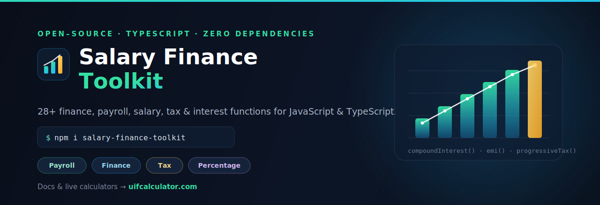

<p align="center">
  
</p>

<h1 align="center">Salary Finance Toolkit</h1>

<p align="center">
  <b>Open-source finance, payroll, salary, tax and interest calculation toolkit for JavaScript and TypeScript.</b>
</p>

<p align="center">
  <a href="#installation"></a>
  <a href="#license"></a>
  
  
  <a href="https://uifcalculator.com"></a>
</p>

<p align="center">
  <a href="https://uifcalculator.com"><b>📚 Live calculators &amp; full documentation → uif calculator</b></a>
</p>

---

## Overview

**Salary Finance Toolkit** is a small, dependency-free, fully-typed library of the
calculations that payroll systems, fintech apps, budgeting tools and HR
dashboards reuse over and over. Every function is:

- **Typed** — written in strict TypeScript and shipped with `.d.ts` declarations.
- **Validated** — inputs are checked and a typed `ValidationError` is thrown on bad data.
- **Documented** — full JSDoc on every public function, with runnable examples.
- **Tested** — covered by a Vitest unit-test suite.
- **Tree-shakeable** — ESM + CJS builds, no side effects, zero runtime dependencies.

> 🌍 This package ships **jurisdiction-neutral** calculation engines. For
> country-specific calculators (including the **South African UIF calculator**),
> tax tables and interactive tools, visit **[uifcalculator.com](https://uifcalculator.com)**.

---

## Table of contents

- [Features](#features)
- [Installation](#installation)
- [Quick start](#quick-start)
- [API documentation](#api-documentation)
  - [Payroll](#payroll)
  - [Finance](#finance)
  - [Tax](#tax)
  - [Percentage &amp; ratio](#percentage--ratio)
  - [Utilities](#utilities)
- [Error handling](#error-handling)
- [UIF Calculator (reference)](#uif-calculator-reference)
- [Examples](#examples)
- [Project structure](#project-structure)
- [Contributing](#contributing)
- [License](#license)

---

## Features

**28+ calculation functions** across four categories:

| Category | Functions |
| --- | --- |
| **Payroll** | `grossToNet`, `netToGross`, `hourlyWage`, `overtimePay`, `annualSalary`, `proRataSalary`, `payPeriodSalary` |
| **Finance** | `compoundInterest`, `simpleInterest`, `emi`, `loanRepayment`, `savingsGrowth`, `inflationAdjustedValue`, `futureValue`, `presentValue`, `cagr`, `roi`, `ruleOf72` |
| **Tax** | `progressiveTax`, `effectiveTaxRate`, `marginalTaxRate` |
| **Percentage & ratio** | `percentageChange`, `percentageIncrease`, `percentageDecrease`, `percentageOf`, `whatPercentageOf`, `ratio`, `splitByRatio` |

---

## Installation

```bash
npm install salary-finance-toolkit
# or
yarn add salary-finance-toolkit
# or
pnpm add salary-finance-toolkit
```

Requires **Node.js 18+**. Works in Node, Deno, Bun, and modern bundlers.

---

## Quick start

```ts
import {
  grossToNet,
  compoundInterest,
  progressiveTax,
  percentageChange,
} from 'salary-finance-toolkit';

// Payroll: take-home pay
grossToNet({ gross: 5000, taxRate: 20, deductions: [{ label: 'Pension', percent: 5 }] });
// → { gross: 5000, tax: 1000, totalDeductions: 250, net: 3750, breakdown: [...] }

// Finance: compound interest, monthly compounding
compoundInterest({ principal: 1000, rate: 5, years: 10, frequency: 'monthly' });
// → { futureValue: 1647.01, interest: 647.01, effectiveAnnualRate: 5.1162 }

// Tax: bring your own brackets
progressiveTax({
  income: 50000,
  brackets: [
    { from: 0, to: 12000, rate: 0 },
    { from: 12000, to: 40000, rate: 20 },
    { from: 40000, rate: 40 },
  ],
});
// → { totalTax: 9600, netIncome: 40400, effectiveRate: 19.2, marginalRate: 40, breakdown: [...] }

// Percentage
percentageChange(200, 250); // → 25
```

CommonJS is supported too:

```js
const { emi } = require('salary-finance-toolkit');
emi({ principal: 200000, annualRate: 6.5, months: 240 }); // → { emi: 1491.15, ... }
```

---

## API documentation

> The reference below is condensed. Full interactive documentation and worked
> examples are hosted at **[uifcalculator.com](https://uifcalculator.com)**.

All calculators accept a single typed input object and return a typed result.
Monetary results are rounded to two decimal places; rates are returned as
percentages (e.g. `19.2` means 19.2%).

### Payroll

#### `grossToNet(input)`
Convert gross salary to net (take-home) pay after a flat tax rate and any
number of fixed/percentage deductions.

```ts
grossToNet({
  gross: 5000,
  taxRate: 20,
  deductions: [{ label: 'Pension', percent: 5 }, { label: 'Union', amount: 25 }],
});
// → { gross: 5000, tax: 1000, totalDeductions: 275, net: 3725, breakdown: [...] }
```

#### `netToGross(input)`
Inverse of `grossToNet` — find the gross required to leave a target net.

```ts
netToGross({ net: 4000, taxRate: 20 }); // → { gross: 5000, tax: 1000, net: 4000, ... }
```

#### `hourlyWage(input)`
Derive an hourly wage (plus daily/weekly/monthly) from an annual salary.

```ts
hourlyWage({ annualSalary: 52000 }); // → { hourly: 25, weekly: 1000, monthly: 4333.33, ... }
```

#### `overtimePay(input)`
Compute overtime pay at a configurable multiplier (default 1.5×).

```ts
overtimePay({ hourlyRate: 20, overtimeHours: 5, regularHours: 40 });
// → { overtimeRate: 30, overtimePay: 150, regularPay: 800, totalPay: 950 }
```

#### `annualSalary(input)`
Annualise an hourly wage into yearly/monthly/weekly figures.

```ts
annualSalary({ hourlyRate: 25 }); // → { annual: 52000, monthly: 4333.33, weekly: 1000 }
```

#### `proRataSalary(input)`
Pro-rate a full-time salary for a partial working period.

```ts
proRataSalary({ fullTimeSalary: 60000, daysWorked: 130 }); // → { proRated: 30000, fraction: 0.5 }
```

#### `payPeriodSalary(input)`
Split an annual salary across a pay frequency (`weekly`, `biweekly`,
`semimonthly`, `monthly`, …).

```ts
payPeriodSalary({ annualSalary: 52000, frequency: 'biweekly' });
// → { perPeriod: 2000, periodsPerYear: 26, frequency: 'biweekly' }
```

### Finance

#### `compoundInterest(input)`
`A = P(1 + r/n)^(n·t)` with selectable compounding frequency.

```ts
compoundInterest({ principal: 1000, rate: 5, years: 10, frequency: 'monthly' });
```

#### `simpleInterest(input)`
`I = P · r · t`.

```ts
simpleInterest({ principal: 1000, rate: 5, years: 3 }); // → { interest: 150, total: 1150 }
```

#### `emi(input)`
Equated Monthly Instalment for an amortising loan (handles 0% interest).

```ts
emi({ principal: 200000, annualRate: 6.5, months: 240 }); // → { emi: 1491.15, ... }
```

#### `loanRepayment(input)`
Loan summary plus an optional full amortisation schedule.

```ts
loanRepayment({ principal: 10000, annualRate: 8, months: 12, includeSchedule: true });
```

#### `savingsGrowth(input)`
Project savings from an initial balance plus recurring contributions.

```ts
savingsGrowth({ initialBalance: 1000, contribution: 200, annualRate: 6, years: 10 });
```

#### `inflationAdjustedValue(input)`
Real (today's-money) value and nominal equivalent after inflation.

```ts
inflationAdjustedValue({ amount: 1000, inflationRate: 3, years: 10 });
// → { realValue: 744.09, nominalEquivalent: 1343.92, purchasingPowerLossPercent: 25.59 }
```

#### `futureValue(input)` / `presentValue(input)`
Time-value of a lump sum, inverse of one another.

#### `cagr(input)`
Compound Annual Growth Rate as a percentage.

#### `roi(input)`
Return on investment: net profit + percentage.

#### `ruleOf72(rate)`
Approximate years to double an investment.

### Tax

#### `progressiveTax(input)`
A **generic marginal-bracket engine**. Supply your own brackets for any country
or tax year — each bracket's rate applies only to the income slice within it.

```ts
progressiveTax({
  income: 50000,
  brackets: [
    { from: 0, to: 12000, rate: 0 },
    { from: 12000, to: 40000, rate: 20 },
    { from: 40000, rate: 40 }, // top, open-ended bracket
  ],
});
// → { totalTax: 9600, netIncome: 40400, effectiveRate: 19.2, marginalRate: 40, breakdown: [...] }
```

Brackets must be **contiguous and ascending** (each `from` equals the previous
`to`); the engine validates this and throws on malformed input.

#### `effectiveTaxRate(input)`
Average tax rate: `taxPaid / income × 100`.

#### `marginalTaxRate(input)`
The rate applied to the next unit of income for a given bracket set.

### Percentage & ratio

| Function | Description | Example |
| --- | --- | --- |
| `percentageChange(old, new)` | Signed % change | `percentageChange(200, 250) → 25` |
| `percentageIncrease(v, p)` | Increase `v` by `p%` | `percentageIncrease(200, 25) → 250` |
| `percentageDecrease(v, p)` | Decrease `v` by `p%` | `percentageDecrease(200, 20) → 160` |
| `percentageOf(v, p)` | `p%` of `v` | `percentageOf(200, 15) → 30` |
| `whatPercentageOf(part, whole)` | `part` as % of `whole` | `whatPercentageOf(30, 200) → 15` |
| `ratio(a, b)` | Simplify a ratio | `ratio(1920, 1080).asString → '16:9'` |
| `splitByRatio(total, weights)` | Split a total by weights | `splitByRatio(1000, [3, 2]).parts → [600, 400]` |

### Utilities

- `round(value, decimals?)` — float-safe rounding.
- `periodsPerYear(frequency)` — resolve periods/year for a `Frequency`.
- `ValidationError` — error class thrown on invalid input.
- `VERSION` — the library version string.

---

## Error handling

Every calculator validates its inputs and throws a typed `ValidationError`:

```ts
import { simpleInterest, ValidationError } from 'salary-finance-toolkit';

try {
  simpleInterest({ principal: -1, rate: 5, years: 1 });
} catch (err) {
  if (err instanceof ValidationError) {
    console.error('Invalid input:', err.message);
    // → "principal" must be greater than or equal to 0, received: -1
  }
}
```

---

## UIF Calculator (reference)

> **Note:** UIF is documented here as a reference formula. It is **intentionally
> not bundled as a JavaScript function**, because UIF is a South-Africa-specific
> statutory rate that changes by government gazette. Keeping it out of the core
> library keeps the package jurisdiction-neutral — but you can model it in a few
> lines using the toolkit's `percentageOf` and `round` helpers (see below). A
> ready-made, always-current **UIF calculator lives at
> [uifcalculator.com](https://uifcalculator.com)**.

### What is UIF?

The **Unemployment Insurance Fund (UIF)** is a South African statutory fund that
provides short-term financial relief to workers who become unemployed or cannot
work due to maternity, adoption/parental leave, or illness, and to the
dependants of a deceased contributor. Under the *Unemployment Insurance
Contributions Act*, both the **employee** and the **employer** contribute.

### The UIF formula

| Component | Value |
| --- | --- |
| Employee contribution | **1%** of monthly remuneration |
| Employer contribution | **1%** of monthly remuneration |
| Combined rate | **2%** |
| Monthly earnings ceiling | **R17 712** (R212 544 / year) |
| Maximum monthly contribution (per party) | **R177.12** |
| Maximum combined monthly contribution | **R354.24** |

The contribution is calculated on remuneration **up to the ceiling**. If an
employee earns above the ceiling, the contribution is calculated as though they
earned exactly the ceiling amount:

```
contributableEarnings = min(monthlyRemuneration, 17712)
employeeUIF           = contributableEarnings × 1%
employerUIF           = contributableEarnings × 1%
totalUIF              = contributableEarnings × 2%
```

**Worked example** — salary **R10 000/month** (below the ceiling):

```
employeeUIF = 10000 × 1% = R100.00
employerUIF = 10000 × 1% = R100.00
totalUIF    = R200.00
```

**Worked example** — salary **R25 000/month** (above the ceiling):

```
contributableEarnings = min(25000, 17712) = 17712
employeeUIF = 17712 × 1% = R177.12   ← capped
employerUIF = 17712 × 1% = R177.12   ← capped
totalUIF    = R354.24
```

> Employees working fewer than 24 hours a month (and certain categories such as
> some public-sector employees) are excluded from contributing. The ceiling and
> rules are set by the Minister of Finance and can change — always verify the
> current figures at **[uifcalculator.com](https://uifcalculator.com)** or with SARS.

### Building it yourself with the toolkit

```ts
import { percentageOf, round } from 'salary-finance-toolkit';

const UIF_CEILING = 17712; // R/month — verify the current value before relying on it
const RATE = 1;            // 1% each for employee and employer

function calculateUIF(monthlyRemuneration: number) {
  const base = Math.min(monthlyRemuneration, UIF_CEILING);
  const employee = round(percentageOf(base, RATE));
  return { employee, employer: employee, total: round(employee * 2) };
}

calculateUIF(25000); // → { employee: 177.12, employer: 177.12, total: 354.24 }
```

---

## Examples

Runnable examples live in [`examples/`](./examples). Run any of them with
[`tsx`](https://github.com/privatenumber/tsx):

```bash
npx tsx examples/payroll.example.ts
npx tsx examples/finance.example.ts
npx tsx examples/tax.example.ts
npx tsx examples/percentage.example.ts
```

---

## Project structure

```
salary-finance-toolkit/
├── assets/            # README banner
├── examples/          # Runnable usage examples (one per module)
├── src/
│   ├── payroll/       # Salary, hourly, overtime, pro-rata, pay periods
│   ├── finance/       # Interest, loans, savings, inflation, time-value
│   ├── tax/           # Progressive engine, effective & marginal rates
│   ├── percentage/    # Percentage & ratio helpers
│   ├── utils/         # Validation + shared helpers
│   └── index.ts       # Public entry point
├── tests/             # Vitest unit tests
├── package.json
├── tsconfig.json
├── CONTRIBUTING.md
├── CHANGELOG.md
└── LICENSE
```

### Local development

```bash
git clone https://github.com/your-org/salary-finance-toolkit.git
cd salary-finance-toolkit
npm install

npm run typecheck   # tsc --noEmit
npm test            # vitest run
npm run build       # tsup → dist/ (ESM + CJS + d.ts)
```

---

## Contributing

Contributions are welcome! Please read **[CONTRIBUTING.md](./CONTRIBUTING.md)**
before opening a pull request. In short:

1. Fork the repo and create a feature branch.
2. Add your calculator under the relevant `src/` module with full JSDoc and input validation.
3. Add unit tests in `tests/` and an example in `examples/`.
4. Run `npm run typecheck && npm test` — keep everything green.
5. Open a PR describing the change and the formula it implements.

Found a calculation bug or want a new calculator? [Open an issue](https://github.com/your-org/salary-finance-toolkit/issues).

---

## License

[MIT](./LICENSE) © Salary Finance Toolkit contributors.

---

<p align="center">
  <sub>
    Built for developers. Powered by the community.<br/>
    📚 More calculators, tax tables &amp; interactive tools at
    <a href="https://uifcalculator.com"><b>uifcalculator.com</b></a>
  </sub>
</p>
